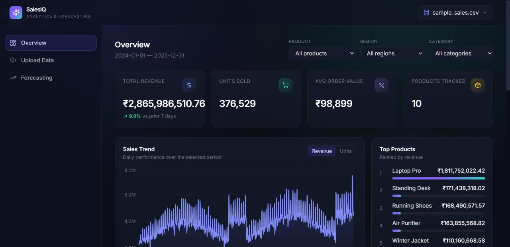
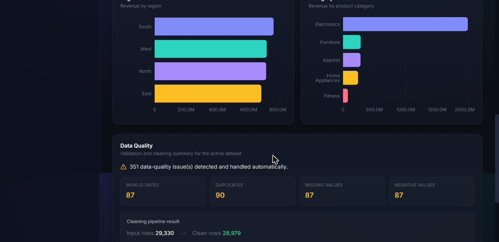
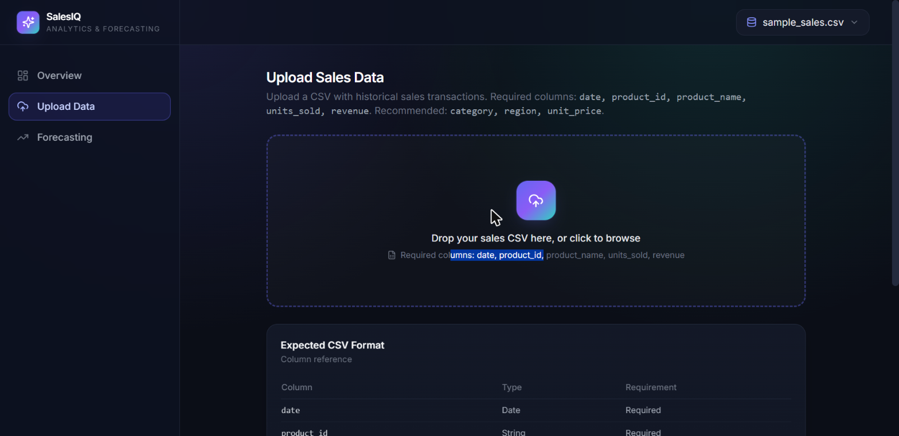
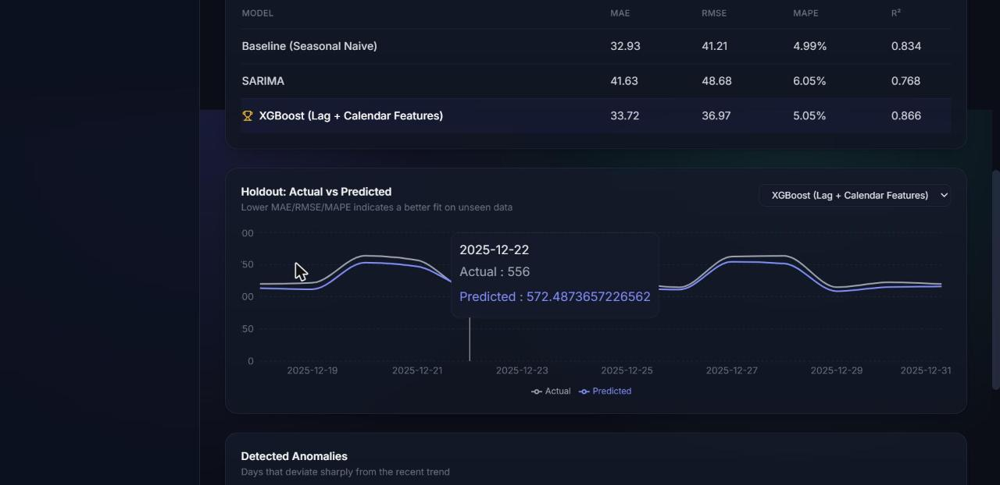
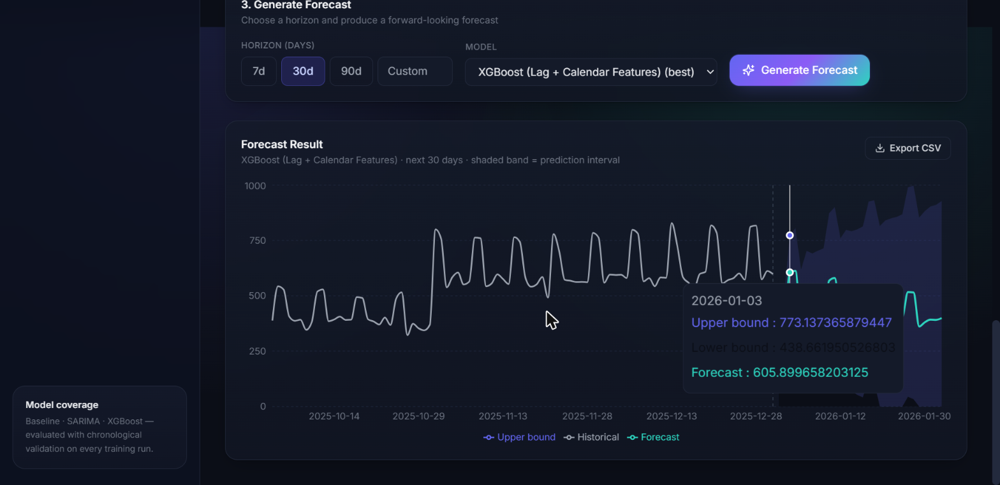

# SalesIQ — Intelligent Sales Analytics & Forecasting Platform

An end-to-end AI/ML platform that turns raw historical sales transactions
into cleaned data, exploratory analytics, and demand forecasts — with a
FastAPI backend, a Next.js dashboard, and a baseline/SARIMA/XGBoost
forecasting pipeline validated with chronological (non-leaking) splits.

```
raw CSV → validation → cleaning → EDA/analytics → feature engineering
        → model training & evaluation → REST API → interactive dashboard
```


## Screenshots

All screenshots below were captured from a live run against the bundled
sample dataset (`data/sample_sales.csv`) — not mockups.

| | |
|---|---|
| **Overview — KPIs & sales trend**  | **Overview — regional/category performance & data quality**  |
| **Upload — validation & cleaning report**  | **Forecasting — model comparison**  |

**Forecasting — 30-day forecast with prediction interval:**


---

## 1. Architecture

```
┌──────────────────────┐
│   Next.js Frontend    │   Dashboard, upload, filters, forecast visualization
│  (React + Recharts)   │
└──────────┬────────────┘
           │ REST (JSON)
┌──────────▼────────────┐
│    FastAPI Backend     │   Validation, orchestration, REST endpoints
│  (app/api, services)   │
└──────────┬────────────┘
           │
     ┌─────┴─────┐
┌────▼─────┐ ┌───▼────────────────┐
│    ML     │ │      Database       │
│ Pipeline  │ │  SQLite (default) /  │
│ (backend/ │ │  PostgreSQL (Docker)  │
│    ml/)   │ │  datasets, training    │
│           │ │  runs, forecasts        │
└───────────┘ └─────────────────────────┘
```

- **Frontend** (`frontend/`) — Next.js 14 App Router + TypeScript + Tailwind
  CSS + Recharts. Talks to the backend only via the REST API (`lib/api.ts`).
- **Backend** (`backend/app/`) — FastAPI. Thin API layer (`app/api/*`) over a
  service layer (`app/services/*`) that calls the framework-agnostic ML
  pipeline (`backend/ml/*`).
- **ML pipeline** (`backend/ml/`) — pure pandas/numpy/scikit-learn/statsmodels/
  xgboost code with no FastAPI dependency, so it is independently testable
  and reusable (e.g. from a notebook or a batch job).
- **Database** — SQLAlchemy models (`app/models/db_models.py`) store dataset
  metadata, training runs, and forecast runs. Defaults to a local SQLite
  file so the project runs with zero external services; `docker-compose.yml`
  wires up PostgreSQL for a production-like setup.
- **File storage** — cleaned datasets are persisted as CSV under
  `backend/storage/datasets/` (mounted as a Docker volume in Compose).

## 2. Tech Stack

| Layer | Technology |
|---|---|
| Language | Python 3.11+ |
| Data | Pandas, NumPy |
| ML | Scikit-learn, XGBoost |
| Time series | Statsmodels (SARIMA) |
| Backend | FastAPI, SQLAlchemy |
| Database | SQLite (local) / PostgreSQL (Docker) |
| Frontend | Next.js 14, React 18, TypeScript |
| Charts | Recharts |
| Styling | Tailwind CSS |
| Containerization | Docker, Docker Compose |

## 3. Quick Start

### Option A — Docker Compose (recommended, full stack incl. PostgreSQL)

```bash
docker compose up --build
```

- Frontend: http://localhost:3000
- Backend API: http://localhost:8000 (docs at `/docs`)
- PostgreSQL: localhost:5432 (user/pass/db: `salesiq`)

The bundled sample dataset lives at `data/sample_sales.csv` — upload it from
the **Upload Data** page to get started immediately.

### Option B — Run locally without Docker (SQLite)

**Backend**

```bash
cd backend
python -m venv .venv
# Windows
.venv\Scripts\activate
# macOS/Linux
source .venv/bin/activate

pip install -r requirements.txt
uvicorn app.main:app --reload --port 8000
```

The API creates a local SQLite database automatically at
`backend/storage/salesiq.db` on first run — no setup required.

> **Python version note:** this project targets Python 3.11+. Prebuilt
> wheels for pandas/scikit-learn/statsmodels/xgboost are broadly available
> from 3.11 through the latest release; if `pip install` tries to compile
> from source on your machine, use a slightly older/newer Python 3.11–3.13
> interpreter or upgrade `pip` first.

**Frontend** (in a second terminal)

```bash
cd frontend
npm install
cp .env.local.example .env.local   # points at http://localhost:8000
npm run dev
```

Visit http://localhost:3000.

### Sample datasets

Several ready-made CSVs are included in `data/`, each exercising a different
part of the pipeline — pick whichever fits what you're testing:

| File | Rows | Purpose |
|---|---|---|
| `sample_sales.csv` | 29,330 | Main dataset: 24 months, 10 products × 4 regions, realistic trend/seasonality, ~450 intentionally dirty rows. Used throughout this README and the model evaluation report. |
| `quick_test_sample.csv` | 734 | One product/region, full 2-year span — fast to open/inspect, still enough history to train on. |
| `fmcg_grocery_sample.csv` | 10,220 | A different business vertical (grocery: high-volume, low-price, weekend/payday seasonality) to confirm the pipeline isn't overfit to the electronics-heavy main dataset. |
| `minimal_history_sample.csv` | 50 | Exactly at the `MIN_HISTORY_DAYS = 45` training boundary. |
| `sparse_gaps_sample.csv` | 342 | ~12% of calendar days are entirely absent from the file (not just dirty — genuinely missing), to exercise the "missing day → treated as zero sales" assumption documented in the model evaluation report. |
| `edge_case_sample.csv` | 13 | Tiny, purpose-built to hit every cleaning rule at once (duplicate, missing required field, negative value, unparsable date, missing optional field). **Too small to train on** — use it only against the Upload page's validation report. |

All of them are regenerated with (run from the **repo root**, with the
backend virtualenv active — both scripts write paths relative to the
current directory, so running them from `backend/` will fail):

```bash
# from the repo root, backend/.venv activated
python scripts/generate_sample_data.py     # main dataset (sample_sales.csv)
python scripts/generate_extra_samples.py   # fmcg_grocery / minimal_history / sparse_gaps
```

`edge_case_sample.csv` and `quick_test_sample.csv` are hand-built/extracted,
not scripted — they're checked into `data/` directly.

## 4. Running Tests

```bash
cd backend
pytest -v
```

Covers: data validation, data cleaning edge cases, feature-engineering
leakage checks (lag features must only reference the past), evaluation
metrics (including zero-actuals MAPE handling), and an end-to-end API test
(upload → train → forecast → export).

## 5. API Reference

Interactive docs are auto-generated by FastAPI at **`/docs`** (Swagger UI)
and **`/redoc`**. Summary:

| Method | Endpoint | Purpose |
|---|---|---|
| GET | `/api/health` | Service health check |
| POST | `/api/datasets/upload` | Upload + validate + clean a CSV |
| GET | `/api/datasets` | List uploaded datasets |
| GET | `/api/datasets/{id}` | Dataset detail + validation/cleaning report |
| GET | `/api/analytics/summary` | KPIs (revenue, units, AOV, growth) |
| GET | `/api/analytics/trends` | Historical trend series (daily/weekly/monthly) |
| GET | `/api/analytics/top-products` | Top products by revenue |
| GET | `/api/analytics/regions` | Regional performance |
| GET | `/api/analytics/categories` | Category performance |
| GET | `/api/analytics/filters` | Available products/regions/categories for filtering |
| POST | `/api/models/train` | Train baseline + SARIMA + XGBoost, evaluate on holdout |
| GET | `/api/models` | List training runs |
| GET | `/api/models/{id}` | Training run detail (metrics, holdout predictions, anomalies) |
| POST | `/api/forecast` | Generate a forecast for a horizon (optionally scoped to a product/region) |
| GET | `/api/forecast/history` | Previous forecast runs |
| GET | `/api/forecast/{id}/export` | Download a forecast as CSV |

All list/create endpoints accept/return JSON; `/api/datasets/upload` and
`/api/forecast/{id}/export` are `multipart/form-data` and CSV respectively.

## 6. Machine Learning Approach

Full detail in [`docs/MODEL_EVALUATION_REPORT.md`](docs/MODEL_EVALUATION_REPORT.md).
Summary:

- **Baseline:** seasonal-naive (value 7 days ago) — the bar every other
  model must clear.
- **Model 1 — SARIMA(1,1,1)(1,1,1,7):** classical statistical model with an
  explicit weekly seasonal term (`statsmodels`), with native confidence
  intervals.
- **Model 2 — XGBoost:** gradient-boosted trees over lag (1/7/14/30), rolling
  mean/std (7/14/30), recent growth rate, calendar features, and exogenous
  business features — `discount`, `marketing_spend`, and a one-day-lagged
  product/category/region peer-group aggregate (`peer_avg_units`, see
  `docs/MODEL_EVALUATION_REPORT.md §5.1`). Multi-step forecasts are produced
  recursively.
- **Validation:** chronological holdout (last *N* days, never shuffled) —
  see `ml/forecasting/pipeline.py::run_training_and_evaluation`.
- **Metrics:** MAE, RMSE, MAPE (zero-actual-safe), R² (reported, not used
  for selection). Final model is chosen by lowest holdout RMSE.
- **Anomaly detection:** rolling z-score on the daily series flags days that
  deviate sharply from a 14-day rolling mean (`detect_anomalies`).
- **Product/region-level forecasting:** both training and forecasting accept
  an optional `product_id`/`region` filter, applied *before* aggregation, so
  a single clean daily series is built per segment rather than mixing series.

## 7. Data Assumptions & Edge Cases

The cleaning pipeline (`ml/preprocessing/cleaning.py`) explicitly handles:

- Missing/invalid dates → row dropped (can't be recovered safely).
- Duplicate rows → exact duplicates dropped.
- Missing `units_sold`/`revenue` → row dropped (these are the forecasting
  target; imputing them would fabricate demand).
- Negative `units_sold`/`revenue`/`unit_price` → row dropped (structurally
  invalid for a sale).
- Missing `unit_price` → imputed with the per-product median (falls back to
  the dataset-wide median).
- Missing `discount`/`marketing_spend` → imputed as `0`.
- Missing `category`/`region` → filled as `"Unknown"` (not dropped, so the
  row's revenue/units are not lost from the top-line numbers).
- Extreme per-product outliers in `units_sold` → **winsorized** (clipped at
  the 99.5th percentile), not dropped — a large spike is potential business
  signal (promotion, stockout recovery), not automatically an error.
- Gaps in the daily time series (a date with no transactions for a segment)
  → filled with 0 during aggregation, documented as an assumption: a missing
  day is treated as "zero recorded sales" for modeling purposes.
- Zero/near-zero actuals in percentage-error calculations → MAPE uses a
  1-unit floor on the denominator to avoid divide-by-zero blowups.
- New products with no history → cannot currently be forecast (no cold-start
  model); flagged as a known limitation.

Every upload returns a `validation_report` (what was detected) and a
`cleaning_summary` (what was done about it), both rendered in the dashboard.

## 8. Repository Structure

```
salesiq/
├── backend/
│   ├── app/
│   │   ├── api/            # FastAPI routers (thin HTTP layer)
│   │   ├── services/       # Orchestration between API and ml/
│   │   ├── models/         # SQLAlchemy models + Pydantic schemas
│   │   ├── config.py
│   │   ├── database.py
│   │   └── main.py
│   ├── ml/
│   │   ├── preprocessing/  # validation.py, cleaning.py
│   │   ├── features/       # feature_engineering.py
│   │   ├── models/         # baseline.py, sarima_model.py, xgboost_model.py
│   │   ├── evaluation/     # metrics.py
│   │   └── forecasting/    # pipeline.py (training + forecast orchestration)
│   ├── tests/               # pytest suite
│   ├── requirements.txt
│   ├── requirements-postgres.txt
│   └── Dockerfile
├── frontend/
│   ├── src/
│   │   ├── app/             # Next.js routes: /, /upload, /forecast
│   │   ├── components/      # dashboard UI components
│   │   └── lib/              # api client, types, dataset context
│   ├── package.json
│   └── Dockerfile
├── data/
│   ├── sample_sales.csv          # main dataset (24 months, 10 products × 4 regions)
│   ├── quick_test_sample.csv     # single-product subset, fast manual testing
│   ├── fmcg_grocery_sample.csv   # different vertical (grocery seasonality)
│   ├── minimal_history_sample.csv# exactly at the training minimum-history boundary
│   ├── sparse_gaps_sample.csv    # calendar days genuinely missing from the file
│   └── edge_case_sample.csv      # tiny, hits every cleaning rule at once
├── scripts/
│   ├── generate_sample_data.py
│   └── generate_extra_samples.py
├── docs/
│   ├── MODEL_EVALUATION_REPORT.md
│   └── screenshots/
├── docker-compose.yml
└── README.md
```

## 9. Known Limitations

See [`docs/MODEL_EVALUATION_REPORT.md § 7`](docs/MODEL_EVALUATION_REPORT.md#7-limitations)
for the full list. Headline items: validation uses a single chronological
holdout rather than a full walk-forward backtest; missing calendar days are
treated as zero sales; XGBoost's prediction interval is a residual-based
approximation rather than a calibrated interval; there is no cold-start
handling for brand-new products; and no external regressors (holidays,
promotions calendar, macro signals) are modeled yet.

## 10. What Would Change for Production Scale

- Move model training to a background worker (Celery/RQ) — the current
  synchronous training endpoint is appropriate for an internship-scale
  dataset but would block on a multi-year, multi-thousand-SKU dataset.
- Swap the single holdout for expanding-window backtesting.
- Add MLflow experiment tracking so model changes are auditable.
- Partition training by product/region and cache trained models instead of
  retraining on every request.
- Add authentication/role-based access before exposing this beyond a trusted
  internal network.
